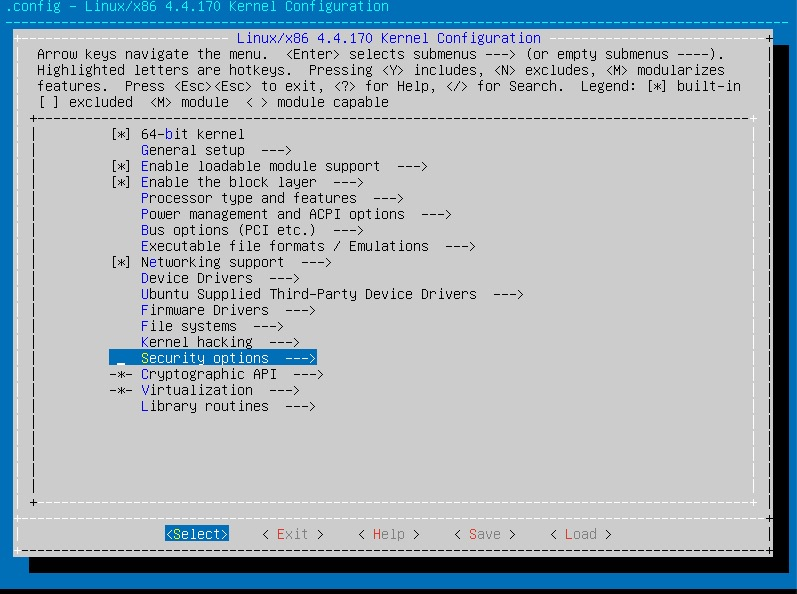
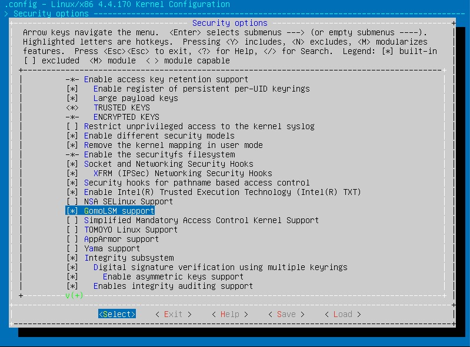
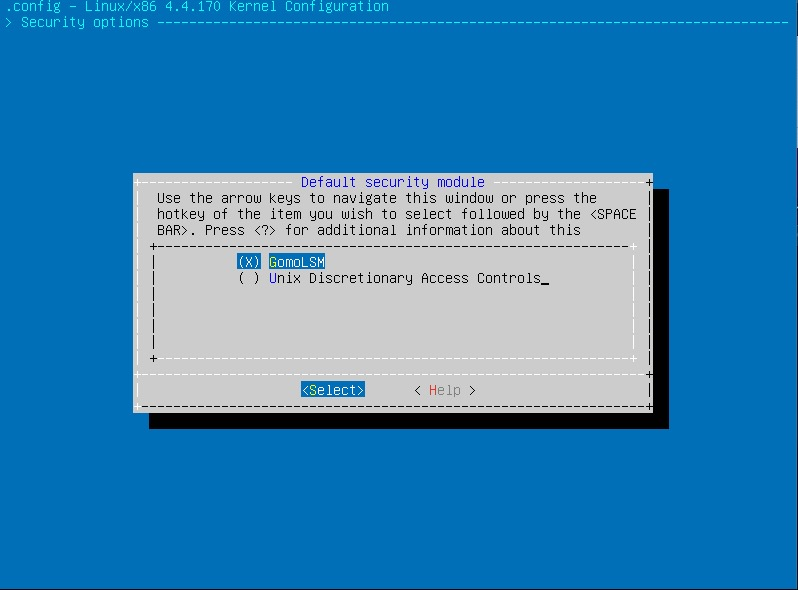

# LSM-based-RBAC

基于角色访问控制的Linux安全模块

## 模块介绍

Linux安全模块（LSM）是Linux内核的一个轻量级通用访问控制框架，但在内核2.6.x后，LSM模块不再运行动态加载到内核，而需要将模块编译进内核，于是需要编写Makefile以及Kconfig，除`kernel/security/GomoLSM`中的Makefile和Kconfig可以直接复制使用外，`kernel/security`中的Makefile以及Kconfig应该在当前内核源码所提供的内容上添加

## 模块功能

通过`role_manager`进行角色管理，通过`-s`选项为显示当前的角色信息，配合参数`user2role`可以显示出用户所对应的角色信息，配合参数`roles`可以显示出角色所拥有的权限

由图1可知，`role1`既不具备创建文件的权限也不具备修改文件名的权限

通过`dmesg`可以看到模块所输出的提示信息

而`role2`拥有创建文件的权限但不拥有修改文件名的权限，

对于角色没有涉及的其他权限，采用默认DAC，该模块不做限制

通过`-ra 角色名 权限`可以加入新的角色，其中权限的给出方式为按顺序给出该该模块针对的操作是否允许被访问，为`0`表示不允许，为`1`表示允许，该模块只是基于LSM对RBAC的简单尝试，当前只针对文件创建与文件重命名这2个操作提供访问控制，下面创建一个对所有操作都允许的新角色`role_new`

通过`-uc uid 角色名`可以更新uid用户的角色，如下将`user1`更换为`role_new`

接着利用`user1`尝试进行文件创建和重命名都是允许的

通过`-rc 角色名 权限`可以更新角色的权限，如下将`role_new`的权限都取消

尝试利用`user1`进行文件创建，被拒绝

## 内核编译

将`/boot/config-'uname -r'`拷贝到源码根目录中，并重命名为`.config`，然后`make menuconfig`即可进行配置编译选项（如果失败需要`apt-get install libncurses5-dev`），对LSM而言，进入`Security options`

将该模块选上，而将SELinux、Yama等其他安全模块都取消

再将该模块选为默认安全模块

接着即可编译内核：
`make bzImage -jN && make modules -jN && make modules_install && make install`
修改`grub`后重启，新的安全模块即可生效
